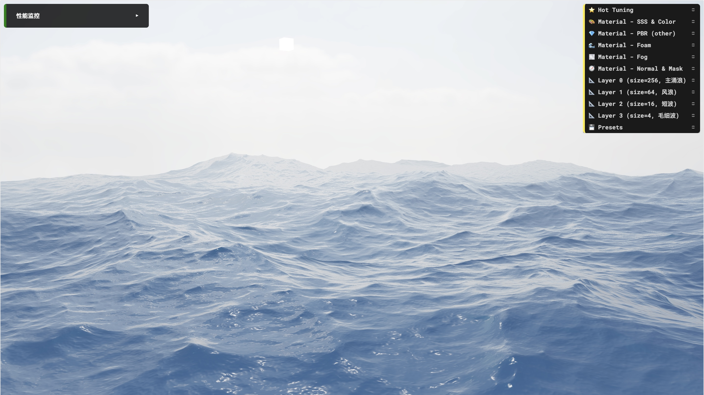
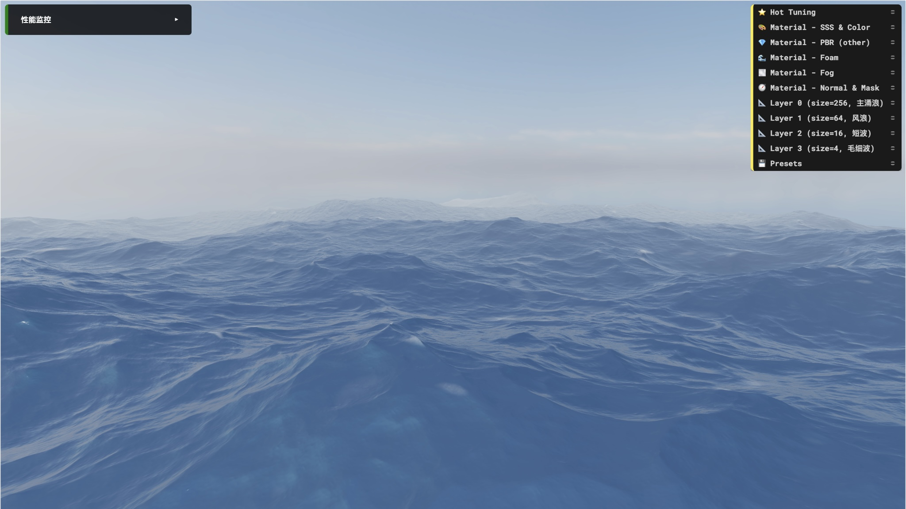

# AImimi Engine

> 前身 (formerly):Refactored Games202 Project。
> 把 GAMES202(实时高质量渲染)作业重构为模块化、可扩展的 WebGL 图形项目;
> 其中包含一个从频谱 (spectrum) 到着色 (shading) 端到端自研的**多层级 (cascade) FFT 海洋**。





## 这是什么 (Overview)

本项目是 GAMES202(GAMES 系列 · 闫令琪《现代计算机图形学入门:实时高质量渲染》)课程作业的重构版。原始作业保留在 `src/scenes/games202/`,在此基础上重构出一套可复用的最小渲染引擎 (engine),并扩展了一条完整的 GPU FFT 海洋 (FFT Ocean) 渲染管线。

目标:从"能跑通作业"过渡到"引擎 (engine) + 场景 (scene)"分层、可维护、可扩展的工程结构。

## 技术亮点 (Highlights)

- **自研最小渲染引擎**:Engine / RenderPass / BaseRenderer / Mesh / Material / Shader 分层抽象,主循环驱动多 pass 渲染。
- **GPU FFT 海洋全链路**:JONSWAP 频谱 (spectrum) → 实时频谱 (realtime spectrum) `h(k,t)` → GPU Stockham IFFT → packed assembly → 4 层 cascade → PBR 着色(Fresnel / Cook-Torrance / 次表面散射 (SSS) / 基于图像的光照 (IBL) / 雾 (fog) / 泡沫 (foam))。
- **GAMES202 作业重构**:实时阴影 (shadow)、预计算辐射传输 (PRT)、屏幕空间反射 (SSR)、Kulla-Conty 多次散射 BRDF。
- **离线工具链(内置外部框架)**:`lut-gen`(Kulla-Conty BRDF LUT 生成)与 `prt`(Nori 2 球谐 (SH) 预计算)为外部教学框架,内置仅为方便使用。
- **工程化**:TypeScript 严格类型、ESLint + Prettier(含 GLSL 格式化)、Vitest 单元测试 + Playwright e2e、Husky + commitlint + commitizen。

## 效果展示 (Showcase)

多层级 FFT 海洋 (FFT Ocean):

[](public/assets/screenshots/sunny-ocean-web.mp4)

> ▶ 点击上图播放 FFT 海洋演示(mp4)

## 快速开始 (Quick Start)

前置:Node.js、支持 **WebGL 1.0** 的现代浏览器(项目显式启用了多个 WebGL 扩展)。

```bash
npm install
npm run dev        # 本地开发 (Vite)
npm run build      # 生产构建(自动复制 shader:copy-shaders.sh)
npm run type-check # TypeScript 类型检查
npm run test       # 单元测试 (Vitest)
npm run test:e2e   # 浏览器端到端 (Playwright)
```

### 离线工具子项目(可选)

`lut-gen` 与 `prt` 是 C++ 子项目(各自带 CMake),**仅在需要重新生成 BRDF LUT / PRT 预计算数据时**才构建;主程序运行不依赖现场编译它们。二者均为外部公开教学框架,内置到仓库只为使用方便。

## 架构总览 (Architecture)

一帧画面的数据流:

```text
Engine
  └─ FrameClock.tick()
     └─ updaters.update()
        └─ WebGLRenderer.render(frameContext)
           └─ RenderPass.execute()
              └─ BaseRenderer.draw()
                 ├─ Mesh.bind()
                 ├─ Material.applyUniforms()
                 └─ gl.drawElements()
```

| 抽象 (abstraction) | 职责                                                          |
| ------------------ | ------------------------------------------------------------- |
| `Engine`           | WebGL 上下文、相机、控制器、GUI、性能监控、FrameClock、主循环 |
| `WebGLRenderer`    | 按顺序执行各 RenderPass                                       |
| `RenderPass`       | 一帧中的一个阶段(forward / shadow / fft / overlay)            |
| `BaseRenderer`     | 把一个 Mesh + Material + Shader 画出来                        |
| `Mesh`             | 几何数据与 VBO / IBO                                          |
| `Material`         | uniforms 与 textures                                          |
| `Shader`           | 编译、链接、缓存 attribute / uniform location                 |

FFT 海洋管线的端到端细节见 [docs/fft-ocean-pipeline.md](docs/fft-ocean-pipeline.md)。

## 场景与模块 (Scenes & Modules)

| 场景                | 内容                                |
| ------------------- | ----------------------------------- |
| `games202/hw1`      | 实时阴影 (Shadow Map → PCSS)        |
| `games202/hw2`      | 预计算辐射传输 (PRT),球谐 (SH) 光照 |
| `games202/hw3`      | 屏幕空间反射 (SSR),cave / cube 场景 |
| `games202/hw4`      | Kulla-Conty 多次散射 BRDF + IBL     |
| `water/fftOcean`    | 多层级 cascade FFT 海洋             |
| `shadertoy/lerrian` | Shadertoy 移植                      |
| `environment`       | 天空盒 (skybox) / 背景              |
| `axes`              | 调试用坐标轴                        |

`src/` 关键模块:`engine.ts`(引擎入口)、`renderers/`(pass 与 renderer)、`simulation/ocean/`(频谱与 IFFT)、`shaders/`、`materials/`、`scenes/`。

## 目录结构 (Project Structure)

```text
src/        引擎与场景源码
tests/      单元 / 集成测试
public/     静态资源(贴图、模型、截图)
docs/       项目级文档
scripts/    工程脚本(构建、文档索引)
lut-gen/    BRDF LUT 离线生成(外部框架,C++)
prt/        PRT 球谐预计算(Nori 2,外部框架,C++)
```

## 文档地图 (Documentation Map)

- [docs/learning-path.md](docs/learning-path.md) — 推荐的代码阅读顺序(从引擎到 FFT)
- [docs/fft-ocean-pipeline.md](docs/fft-ocean-pipeline.md) — FFT 海洋端到端数据流与各阶段职责
- [docs/fft-ocean-theory.md](docs/fft-ocean-theory.md) — 理论、数学↔代码映射、落地陷阱
- [docs/CONVENTIONS.md](docs/CONVENTIONS.md) — 命名 / 提交 / 目录约定
- [docs/INDEX.md](docs/INDEX.md) — 全量文档索引(自动生成)

踩坑复盘 (postmortem):

- [src/simulation/ocean/fft/postmortem-fft-axis-misalignment.md](src/simulation/ocean/fft/postmortem-fft-axis-misalignment.md) — FFT 纹理轴 / 世界轴错位

模块级 README:`src/renderers/` · `src/objects/` · `src/shaders/` · `src/lights/visualizers/`

## 开发约定 (Conventions)

- 提交信息遵循 Conventional Commits,使用 `npm run commit`(commitizen)。
- 文档命名、目录组织见 [docs/CONVENTIONS.md](docs/CONVENTIONS.md)。
- 代码风格:ESLint + Prettier(含 `prettier-plugin-glsl`);提交前由 Husky + lint-staged 校验。

## License & 致谢 (Acknowledgements)

本仓库为**个人学习用途**的 GAMES202 作业重构。

- 课程:GAMES202《现代计算机图形学入门:实时高质量渲染》(闫令琪 / GAMES)。
- `prt/` 基于 Wenzel Jakob 的 [Nori 2](https://wjakob.github.io/nori/)(EPFL Advanced Computer Graphics)。
- `lut-gen/` 基于 GAMES202 课程提供的 Kulla-Conty BRDF LUT 生成框架。

内置的外部子项目版权归原作者所有,各自遵循其原始许可协议。
